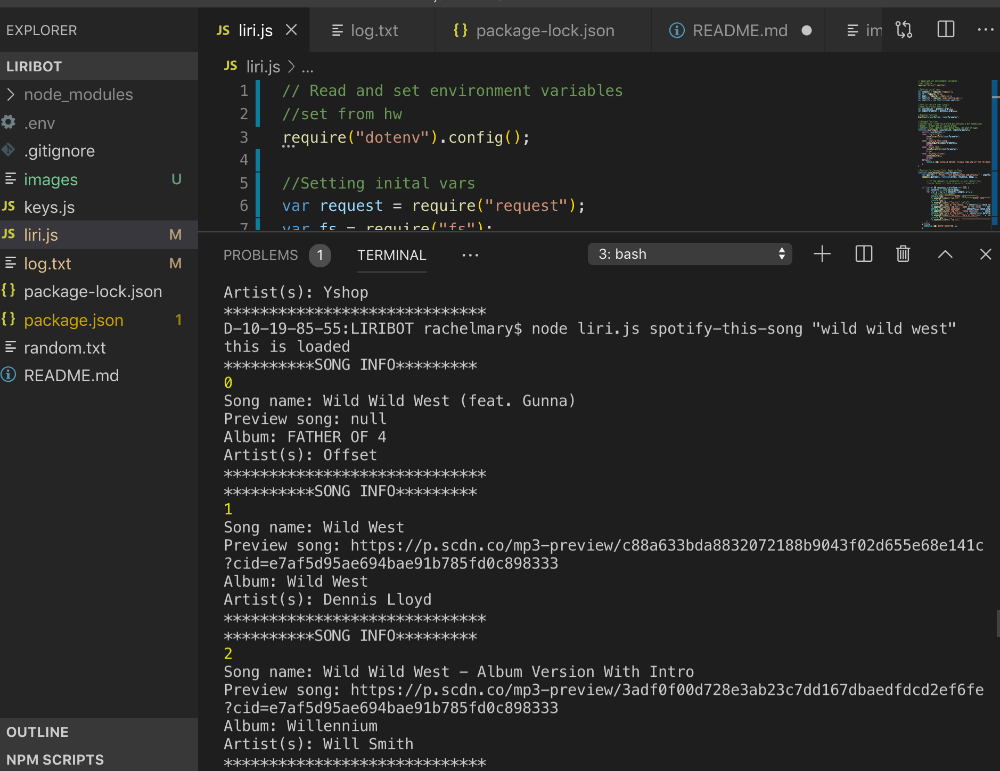
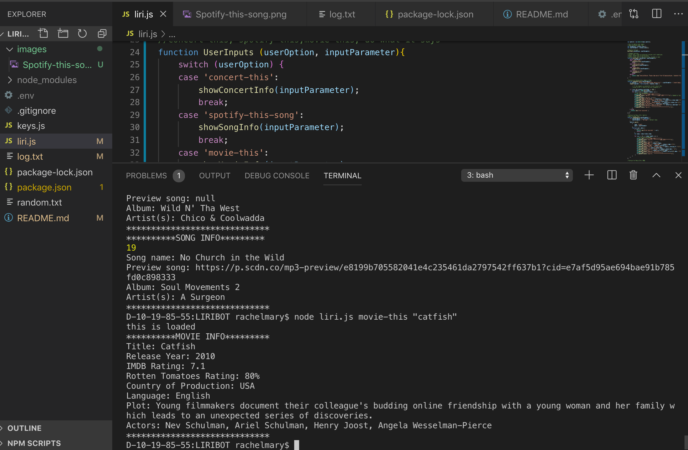
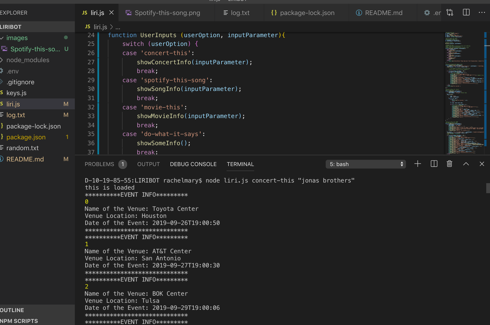
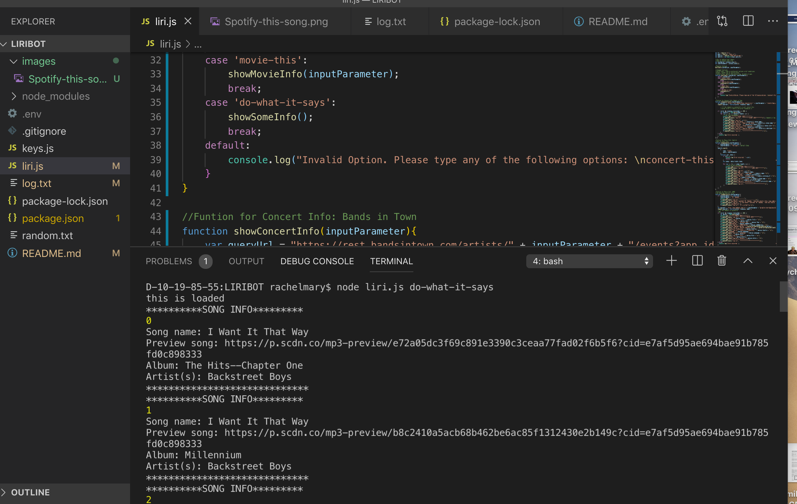

# Welcome to LIRIBOT

Overview:
LIRIBOT is a Language Interpretation and Recognition Interface, similar to Amazon's Alexa or Apple's SIRI. However LIRI has a key difference in that it uses language interpretation instead of speech interpretation. This is an extrememly user-friendly technolgy that can enhance any music or movie lover's experience by providing them with either background information about their favorite movies and songs or information about their favorite artists upcoming tourdates.  

# Technologies Used:
 * APIs:
    * Spotify
    * OMDB
    * Bands in Town

* Programming Language:
    * Javascript
    * Node 

* NPM Depndencies within Node
    * .gitignore
    * dotenv
    * axios
    * node
    * fs

# Instructions:
There are 4 key ways to use the LIRIBOT. All involve using the terminal commands to pull api information. 

* 1)The first is to search for a song using the Spotify-this-song command. This will pull song information from the spotify API including song name, artist, and album. If the user does not enter a song but uses this command, then the command will pull up the song "I saw the sign" by Ace of Base
Search for Song using Spotify-this-song

* 2)Users can also search for movie information using the movie-this command. This will pull information from the OMDB API and provide information including the plot, language, release year, imdb rating, rotton tomatoes rating, actors and language. If the user does not type a movie but uses this command in the terminal, then the command will pull up OMDB data for the movie, "Mr. Nobody"
Search for Movie using movie-this

* 3)Next, there is the concert-this command which uses the bands in town API where uses can access information about their favorite bands upcoming dates and venues. The example in the image below shows an example of the Jonas brothers and informaiton about their upcoming tour dates.
Search for concert using concert-this

* 4)Lastly, the command do-what-it-says will pull information stored from the random.txt file which had "spotify-this-song "I want it that way"" So it will use the spotify api to repeat the first command of spotify-this-song and pull up the name, artist and album for "I want it that way" by the backstreet boys.
Do-what-it-says will refrence random.txt and search for "I want it that way"

## Link to deployed site:
(https://rmjones112.github.io/LIRIBOT/) 

